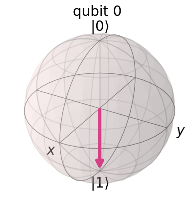
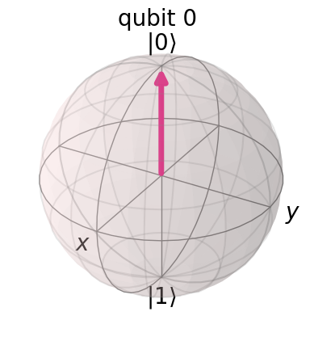

# Bloch Sphere

### Description

A Bloch sphere is a geometric representation of the state space of a qubit, which is a two-level quantum system. The Bloch sphere provides a useful way to visualize the state of a qubit and the transformations applied to it through quantum gates. Each point on the surface of the Bloch sphere corresponds to a unique pure state of a qubit.

The Bloch sphere has the following properties:

1. The sphere has a radius of 1.
2. The north pole of the Bloch sphere represents the |0⟩ state.
3. The south pole represents the |1⟩ state.
4. The equator represents an equal superposition of the |0⟩ and |1⟩ states, with various relative phases.

Quantum gates acting on qubits can be represented as rotations on the Bloch sphere. For example, a Pauli-X gate corresponds to a 180-degree rotation around the x-axis, a Pauli-Y gate corresponds to a 180-degree rotation around the y-axis, and a Pauli-Z gate corresponds to a 180-degree rotation around the z-axis. Other gates, such as the Hadamard and phase gates, also have corresponding rotations on the Bloch sphere.

The Bloch sphere representation is particularly useful for understanding single-qubit operations and their effects on qubit states. However, it is important to note that the Bloch sphere visualization is limited to single qubits and does not easily extend to multi-qubit systems or entangled states.

### Sample Images


Images generated with qiskit.


<div>

<figure><figcaption><p>Qubit in |1⟩ state</p></figcaption></figure>

 

<figure><figcaption><p>Qubit in |0⟩ state</p></figcaption></figure>

</div>

### Sample Code



```python
from qiskit import QuantumCircuit
from qiskit.quantum_info import Statevector
from qiskit.visualization import plot_bloch_multivector

# Prepare the 6 qubit states
states = [
    [1, 0],  # |0>
    [0, 1],  # |1>
    [1 / (2**0.5), 1 / (2**0.5)],  # |+>
    [1 / (2**0.5), -1 / (2**0.5)],  # |->
    [1 / (2**0.5), 1j / (2**0.5)],  # |i+>
    [1 / (2**0.5), -1j / (2**0.5)]  # |i->
]

bloch_spheres = []

# Initialize each qubit separately and plot its Bloch sphere
for state in states:
    qc = QuantumCircuit(1)
    qc.initialize(state, 0)
    statevector = Statevector.from_instruction(qc)
    bloch_spheres.append(plot_bloch_multivector(statevector))

# Display the Bloch spheres
for i, sphere in enumerate(bloch_spheres):
    display(sphere)
```




Q# does not have a built-in visualizer for bloch sphere.


```csharp
namespace Sample {
    // Import dependencies
    open Microsoft.Quantum.Diagnostics;

    @EntryPoint()
    operation Sample() : Unit {
        use q = Qubit() {
            // Dump the state of the qubit
            DumpMachine();
        }
    }
}
```


